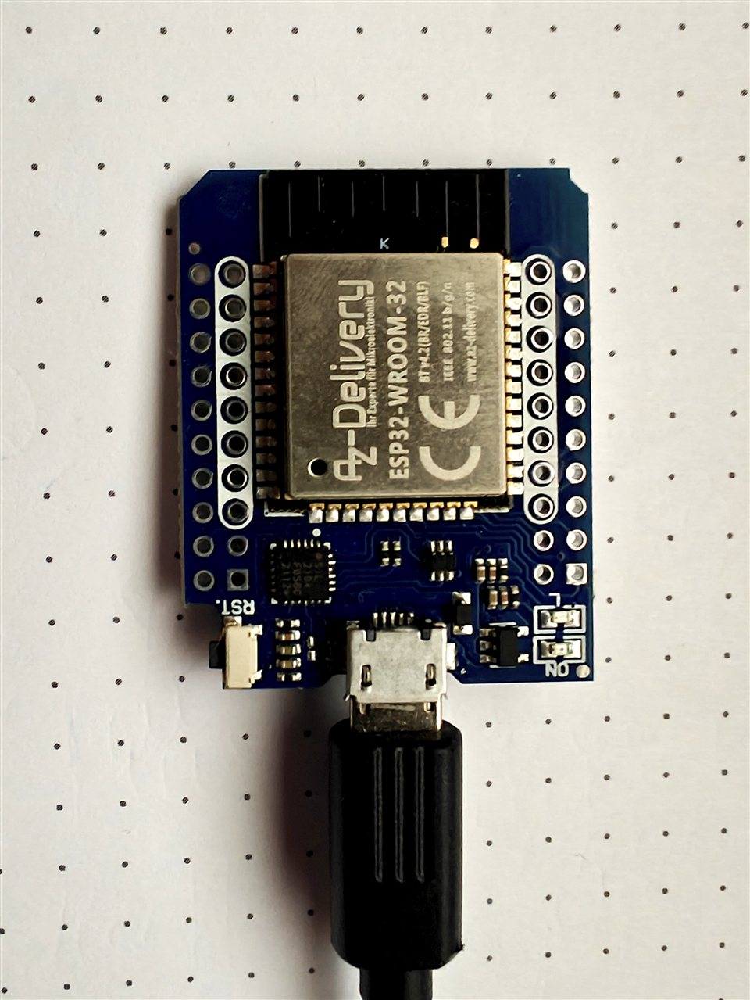
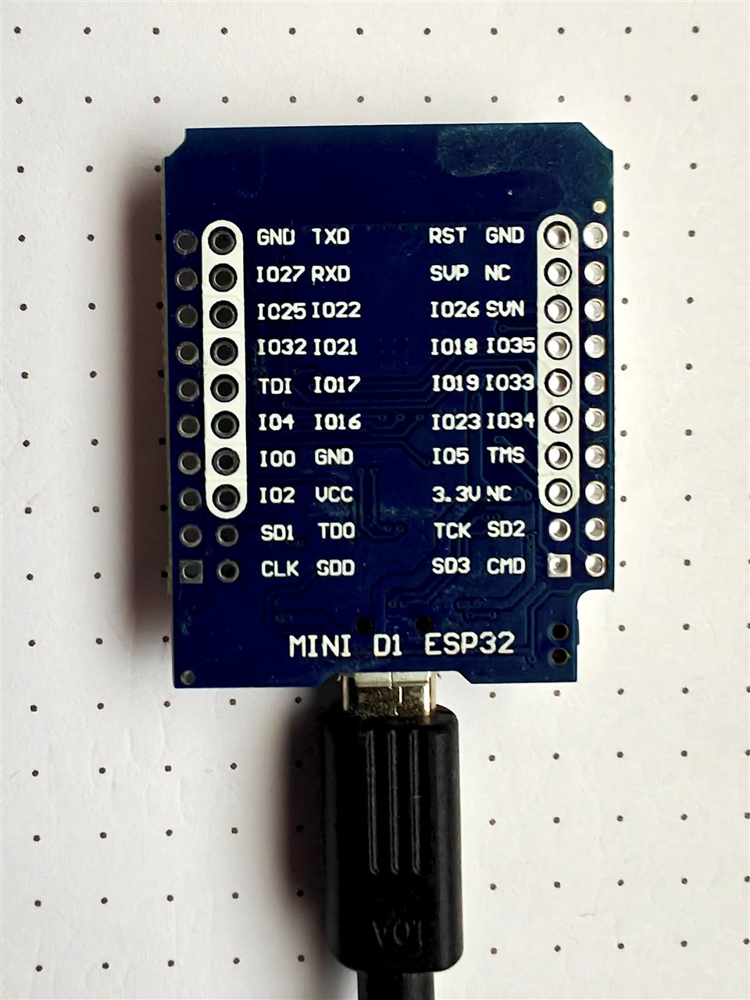
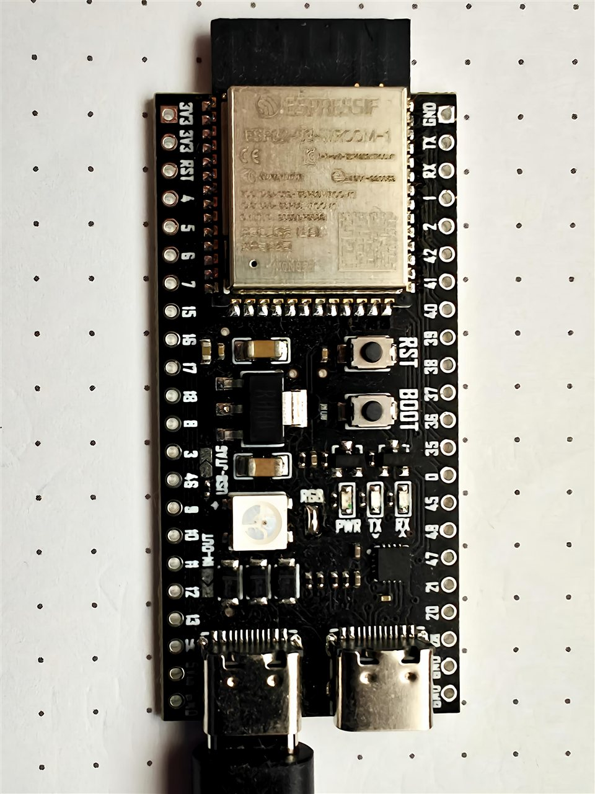
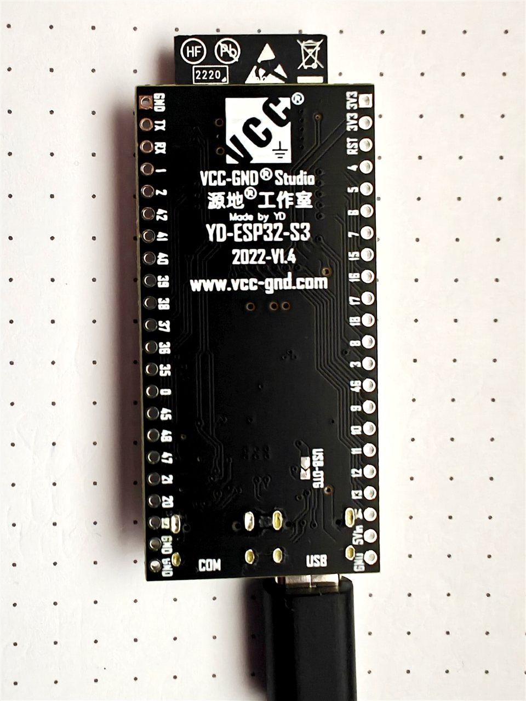
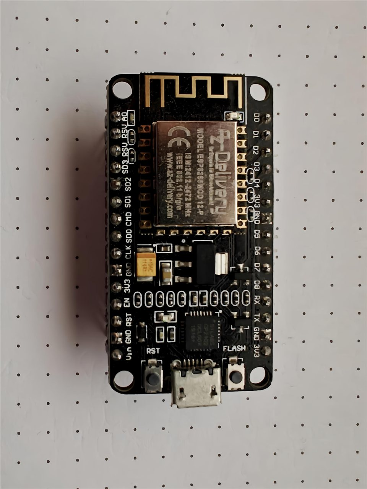
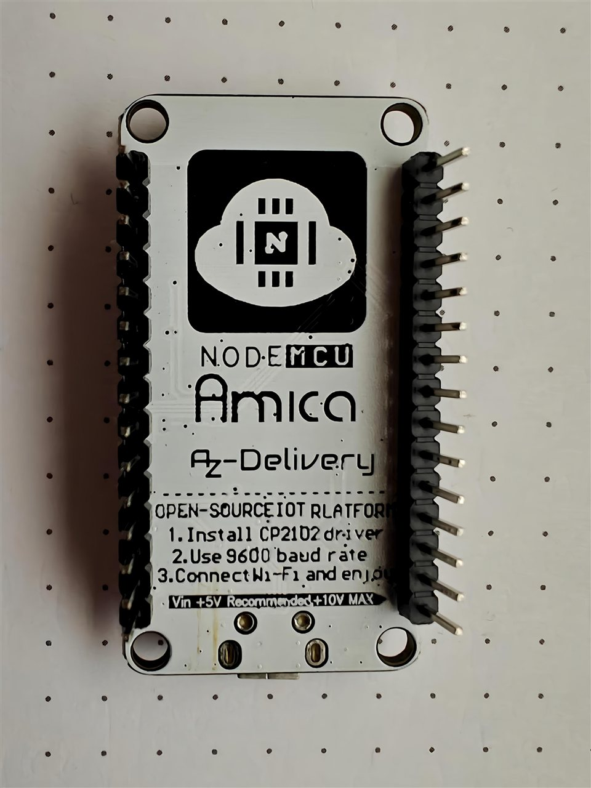

# ESP32.esp-hub — Basis-Firmware & Projektübersicht


[](https://www.gnu.org/licenses/gpl-3.0)
[](https://www.paypal.com/donate/?business=martin%40bchmnn.de&currency_code=EUR)

> **Standard-Firmware für ESP32** und Einstieg in die MPunktBPunkt-ESP-Familie: WiFi, Heartbeat, OTA und Web-UI als gemeinsame Basis. Zentrale Verwaltung über [iobroker.esp-hub](https://github.com/MPunktBPunkt/iobroker.esp-hub).

---

## Überblick

`esp-hub-base` **v1.7.0** ist die gemeinsame Grundlage aller Firmwares in dieser Familie. Sie übernimmt:

- WLAN über **WiFiManager** (Captive Portal, keine Zugangsdaten im Quellcode)
- periodischen **Heartbeat** an den ioBroker-ESP-Hub
- **OTA** (Hub-Push oder Upload in der ESP-Web-UI)
- eine **Status-Webseite** mit Live-Updates (SSE)

Eigene Sensoren und Logik gehören in klar markierte Abschnitte — der Rest bleibt unverändert. Daraus entstehen die abgeleiteten Projekte unten.

```text
  [ ESP32 / ESP32-S3 Nodes ]
           │ Heartbeat / OTA
           ▼
  [ iobroker.esp-hub :8093 ]  ← Geräte, Firmware, Compile, USB-Flash
           │
           ▼
  [ ioBroker States / Dashboard ]
```

---

## Sicherheit: WLAN & Geheimnisse

**In den `.ino`-Dateien stehen keine WLAN-SSIDs und keine Passwörter.**

| Was | Wie |
|-----|-----|
| WLAN | Nur über WiFiManager-Portal beim ersten Start (oder nach Reset) |
| Speicherung | Zugangsdaten liegen im ESP-NVS (Flash), nicht im Git |
| Hub-Adresse | Optionaler Default `HUB_HOST` / `HUB_PORT` — kann im Portal überschrieben werden |
| Reset | BOOT-Taste ca. **3 s** beim Einschalten → Portal erneut, gespeichertes WLAN weg |

Portal-Namen der Familie (Beispiele):

| Firmware | Captive-Portal-SSID |
|----------|---------------------|
| esp-hub-base | `ESP-Hub-Setup` |
| esp32.network | `ESP-Net-Setup` |
| esp32.webradio | `ESP-WebRadio` |
| esp32.io-control | `ESP-IO-Setup` |
| esp32.communicator | `ESP-Comm-Setup` |
| esp32.MeterMaster | `MeterMaster-Setup` |

> **Hinweis:** `WiFi.begin(ssid, psk, …)` im Communicator nutzt nur die **bereits gespeicherten** NVS-Daten (`WiFi.SSID()` / `WiFi.psk()`), z. B. für BSSID-/Kanalwechsel — keine Klartext-Secrets im Sketch.

---

## Projektfamilie (Stand)

| Projekt | Version | Kurzbeschreibung | Repo |
|---------|---------|------------------|------|
| **ESP32.esp-hub** (diese Basis) | 1.7.0 | Heartbeat, OTA, Status-UI, Vorlage für neue Nodes | [ESP32.esp-hub](https://github.com/MPunktBPunkt/ESP32.esp-hub) |
| **iobroker.esp-hub** | 0.5.8 | ioBroker-Adapter: Geräte, OTA, USB-Flash, Compiler, Monitor | [iobroker.esp-hub](https://github.com/MPunktBPunkt/iobroker.esp-hub) |
| **esp32.network** | 1.6.6 | LAN-Scanner, Inventar, optional FritzBox TR-064 | [esp32.network](https://github.com/MPunktBPunkt/esp32.network) |
| **esp32.webradio** | 2.4.0 | Internet-Radio/Podcasts im Browser, radio-browser, Favoriten | [esp32.webradio](https://github.com/MPunktBPunkt/esp32.webradio) |
| **esp32.io-control** | 1.6.1 | GPIO/ADC/DAC/PWM, I2C/SPI, Takt, DMM, Mini-Oszi | [esp32.io-control](https://github.com/MPunktBPunkt/esp32.io-control) |
| **esp32.communicator** | 1.8.0 | ESP-NOW Messenger, Anrufe, WebRTC-Signaling über Hub | [esp32.communicator](https://github.com/MPunktBPunkt/esp32.communicator) |
| **esp32.MeterMaster** | 0.4.3 | OLED-Zähleranzeige für MeterMaster + optional Hub-Heartbeat | [esp32.MeterMaster](https://github.com/MPunktBPunkt/esp32.MeterMaster) |

### Was welches Projekt macht

- **esp-hub-base** — Minimaler Node: online im Hub, OTA-fähig, Web-Status. Ideal als Vorlage.
- **iobroker.esp-hub** — Zentrale im Browser (`http://<ioBroker-IP>:8093`): Geräteübersicht, Firmware-Ablage, Sketch kompilieren, USB flashen, Seriell-Monitor, OTA anstoßen.
- **esp32.network** — Subnetz scannen, Geräte benennen/überwachen; optionale Anreicherung über FritzBox.
- **esp32.webradio** — ESP hostet die UI; Streams spielen im Browser (HTML5). Lokal/Genre/Quellen über radio-browser.info; Podcasts per ESP-RSS-Proxy. Audio-Ausgabe = Browser (auch BT-Lautsprecher am Handy/PC); kein A2DP vom Chip.
- **esp32.io-control** — Labor-/Werkstatt-IO: Pinout, Modi, Bus-Tools, PWM/CLOCK, Zähler, DMM, ADC-Scope.
- **esp32.communicator** — Direktfunk per ESP-NOW parallel zu WiFi; Chat-UI; Anruf/WebRTC-Signaling über den Hub.
- **esp32.MeterMaster** — Kleines OLED für Zählerstände (MeterMaster-Adapter); kann zusätzlich im ESP-Hub erscheinen.

---

## Features der Basis (`esp-hub-base`)

- **WiFiManager** — Captive Portal `ESP-Hub-Setup`
- **ESP-Hub Heartbeat** — Registrierung inkl. `chipModel`, `freeSketch`, `ios`
- **IO-Werte** — eigene Messwerte im Hub-Dashboard
- **OTA** — Hub-Push oder Drag & Drop in der ESP-Web-UI
- **Web-UI** — Status + OTA unter `http://<ESP-IP>/` (SSE)
- **mDNS** — typisch `http://esphub-<mac6>.local/`
- **WLAN-Reset** — BOOT 3 s beim Einschalten

---

## Voraussetzungen

| Typ | Details |
|-----|---------|
| **Board** | ESP32 / ESP32-S3 (ESP8266 nur mit Anpassungen) |
| **Partition** | Empfehlung: **Minimal SPIFFS** (~1,9 MB App) für OTA-Kopffreiheit |
| **WiFiManager** | tablatronix / tzapu |
| **ArduinoJson** | bblanchon v6 oder v7 |
| **ioBroker** | [iobroker.esp-hub](https://github.com/MPunktBPunkt/iobroker.esp-hub) |

---

## Referenz-Hardware

| ESP32 D1 Mini | | ESP32-S3 | | NodeMCU (ESP8266) | |
|:---:|:---:|:---:|:---:|:---:|:---:|
|  |  |  |  |  |  |

*Oben / unten je Board — Referenzfotos aus dem MPunktBPunkt-Labor.*

---

## Quickstart (Basis)

1. `esp-hub-base.ino` öffnen  
2. Abschnitt **KONFIGURATION** anpassen — **nur Name/Hub, keine WLAN-Secrets:**

```cpp
#define DEVICE_NAME  "Mein ESP32"
#define HUB_HOST     "192.168.178.113"   // deine ioBroker-/Hub-IP
#define HUB_PORT     8093
```

3. Flashen (USB oder später OTA)  
4. Hotspot **`ESP-Hub-Setup`** verbinden → **WLAN + Hub-IP** im Portal eingeben  
5. Dashboard: `http://<ioBroker-IP>:8093`  
6. ESP-Web-UI: `http://<ESP-IP>/`

> **ESP32-S3:** USB-Port mit **COM**-Beschriftung; vor dem Flashen kurz **RST** tippen.

---

## Vorkompilierte Firmware

Schema: `{name}.{version}.{family}.bin`

| Datei | Board |
|-------|-------|
| `esp-hub-base.1.7.0.esp32.bin` | ESP32 / D1 Mini |
| `esp-hub-base.1.7.0.esp32s3.bin` | ESP32-S3 |

Gleiche Namenskonvention gilt für die abgeleiteten Repos und die Ablage unter `iobroker.esp-hub/firmware/`.

---

## Sketch-Struktur (Vorlage)

| Abschnitt | Beschreibung | Anpassen? |
|-----------|--------------|-----------|
| **KONFIGURATION** | Name, Hub-IP/Port, Intervalle, Reset-Pin | ✅ |
| **EIGENE HARDWARE** | Pin-Definitionen | ✅ |
| **IO-TABELLE** | Messwerte fürs Dashboard | ✅ |
| **MESSWERTE EINLESEN** | `updateIoValues()` | ✅ |
| **AB HIER NICHT VERÄNDERN** | WiFi, Web-UI, Heartbeat, OTA, Loop | ❌ |

---

## Heartbeat (`POST /api/register`)

| Feld | Beschreibung |
|------|--------------|
| `mac`, `name`, `hwType`, `version`, `ip` | Identität |
| `rssi`, `uptime`, `freeHeap` | Laufzeit |
| `chipModel` | z. B. `ESP32-S3`, `ESP32-D0WDQ6` |
| `freeSketch` | freier OTA-Flash (Bytes) |
| `ios` | Sensor-/Aktorwerte als Objekt |

Antwort u. a.: gewünschtes Heartbeat-Intervall, optionale `otaUrl` für Push-Updates.

---

## Typischer Ablauf mit dem Hub

1. Adapter [iobroker.esp-hub](https://github.com/MPunktBPunkt/iobroker.esp-hub) installieren und starten (Port **8093**)  
2. Firmware flashen (USB im Hub-UI oder vorkompilierte `.bin`)  
3. Portal: WLAN + Hub-IP setzen  
4. Gerät erscheint unter **Geräte**  
5. Updates später per **OTA** aus dem Hub oder per Web-Upload am ESP  

USB-Hinweise (LXC/Proxmox): siehe README von `iobroker.esp-hub` — Geräte-Major `c 188:*` und Mounts für `ttyUSB0`/`ttyUSB1` bzw. `by-id`, falls mehrere Adapter.

---

## Neue Firmware aus der Basis ableiten

1. `esp-hub-base.ino` kopieren / Fork dieses Repos  
2. `DEVICE_NAME`, `FW_VERSION`, Portal-SSID anpassen  
3. Hardware + `ios` + `updateIoValues()` ergänzen  
4. Web-UI nur erweitern, Heartbeat-/OTA-Kern möglichst belassen  
5. Bins als `{projekt}.{version}.esp32.bin` / `.esp32s3.bin` ablegen und optional im Hub bündeln  

---

## Lizenz

GNU General Public License v3.0 © MPunktBPunkt — siehe [LICENSE](LICENSE)

[](https://www.paypal.com/donate/?business=martin%40bchmnn.de&currency_code=EUR)
